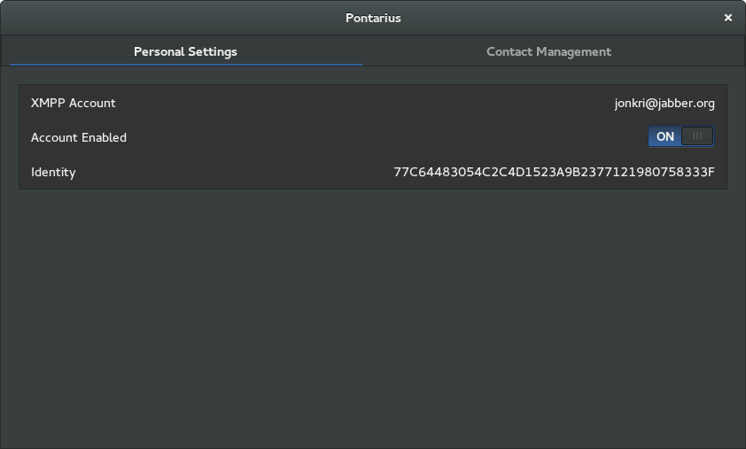
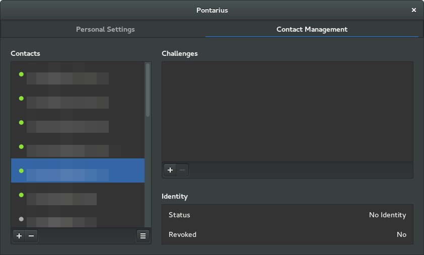
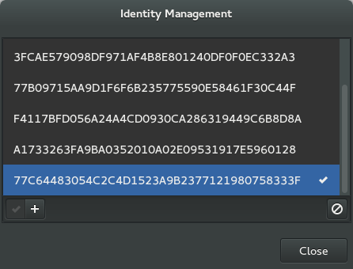
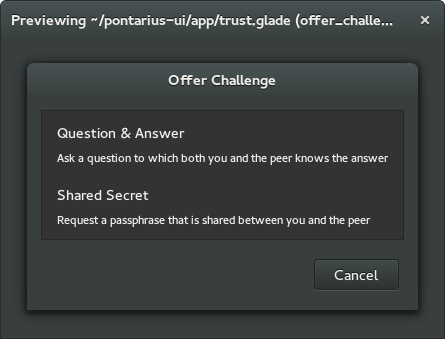
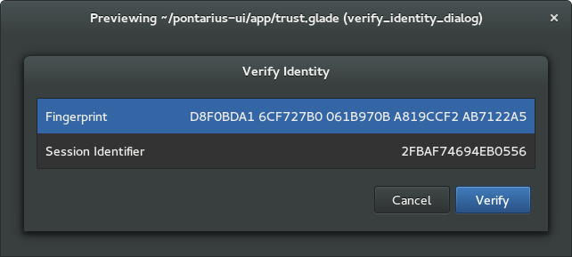
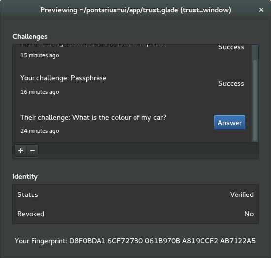

Pontarius User Interface
========================

This is a work in progress of a user interface for [Pontarius
Service](https://github.com/pontarius/pontarius-service).

The UI currently consists of one window with two tabs:

Identities can be created, revoked, and selected for use:

Features yet/soon to be realized include:

Copyright & License
-------------------

Copyright © Jon Kristensen, 2014.

Licensed under the GNU Affero General Public License, Version 3; see the
LICENSE file for more information.

Contributions
-------------

External contributors must sign a contributor agreement. Contact us for more
information.

Contact
-------

Please refer to [Jon Kristensen's contact
details](http://www.jonkri.com/contact/).
