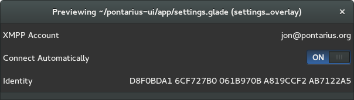
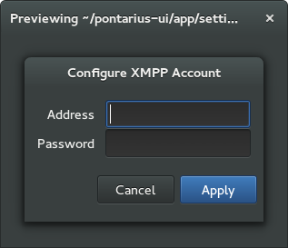
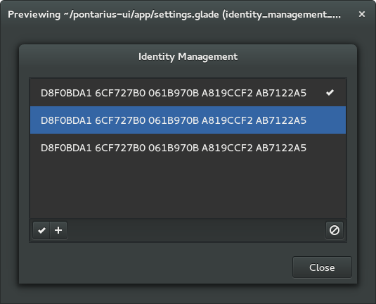
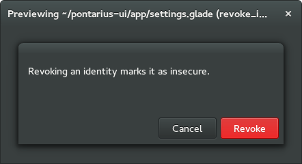

Mock-Ups
========

Settings
--------

The settings panel overlay (to be integrated with the GNOME control center application) allows the user to configure three things: The XMPP account to use, whether to connect automatically, and which identity (GnuPG key) to use (during Pontarius key exchanges).

Clicking on the account row brings up the account settings.

Clicking on the identity row allows the user to select which identity (key) is used, generate a new identity, and mark an identity as revoked.

If the revoke button (the one with a "forbidden" icon) is clicked, the user is asked to confirm the (destructive) action. After this is done, the Identity Management dialog displays a forbidden icon in the place where the checkmark would be.

Trust
-----

The Trust Management window shows the list of incoming and outgoing challenges, buttons for performing/removing challenges, actions for verifying or revoking the identity of a peer, as well as fingerprint information. The blue button indicates the suggested action.

Clicking on the "-" button removes the record of the challenge. Clicking on the "+" button produces the Offer Challenge dialog:

Selecting the Question & Answer option results in the following dialog. The Shared Secret equivalent is very similar but has only one field ("Secret").

Clicking on the Status row allows the user to verify the fingerprint and/or the session identifier.

Analogously, clicking on the Revoked row will allow for the (destructive) action of revoking the peer's identity.

Trademark Notice
----------------

The GNOME logo and GNOME name are registered trademarks or trademarks of GNOME Foundation in the United States or other countries.
