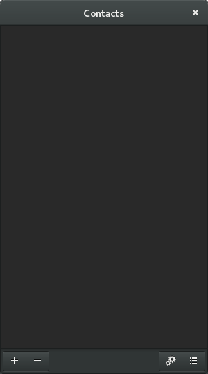
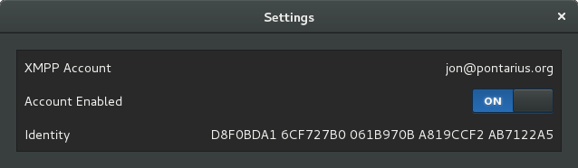

The Pontarius GNOME™ App
========================

A work in progress for a main Pontarius application window (a GtkApplication). This app is intended to be used together with the extension defined in the "extension" directory of this repository, as well as [Pontarius Service](https://github.com/pontarius/pontarius-service).

Legal
-----

The GNOME logo and GNOME name are registered trademarks or trademarks of GNOME Foundation in the United States or other countries.
