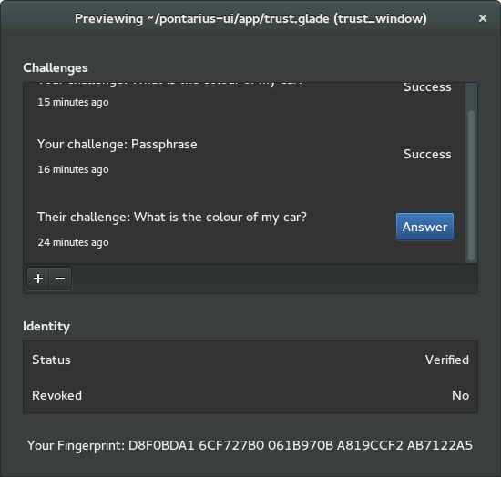
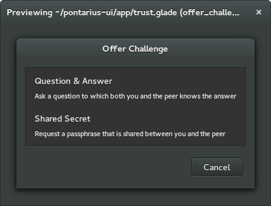
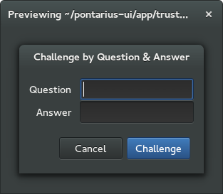
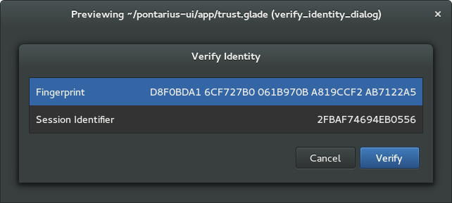

Mock-Ups
========

Trust
-----

The Trust Management window shows the list of incoming and outgoing challenges, buttons for performing/removing challenges, actions for verifying or revoking the identity of a peer, as well as fingerprint information. The blue button indicates the suggested action.

Clicking on the "-" button removes the record of the challenge. Clicking on the "+" button produces the Offer Challenge dialog:

Selecting the Question & Answer option results in the following dialog. The Shared Secret equivalent is very similar but has only one field ("Secret").

Clicking on the Status row allows the user to verify the fingerprint and/or the session identifier.

Analogously, clicking on the Revoked row will allow for the (destructive) action of revoking the peer's identity.

