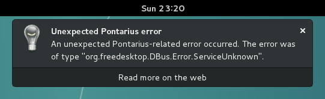

Pontarius GNOME™ extension
==========================

A work in progress to enable Pontarius functionality, such as Pontarius-related desktop notifications, in GNOME Shell. This extension is intended to be used together with the Pontarius GtkApplication defined in the "application" directory of this repository, as well as [Pontarius Service](https://github.com/pontarius/pontarius-service).

Legal
-----

The GNOME logo and GNOME name are registered trademarks or trademarks of GNOME Foundation in the United States or other countries.
